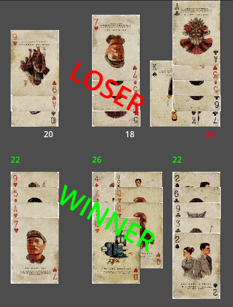
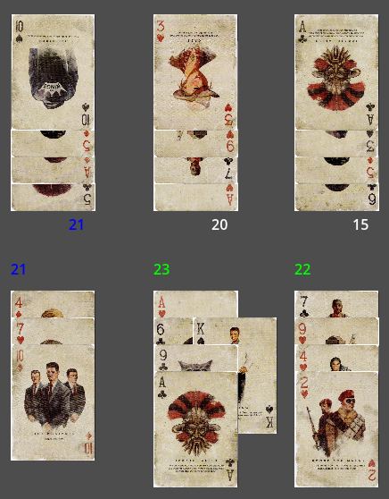
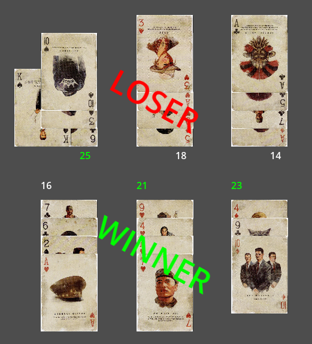
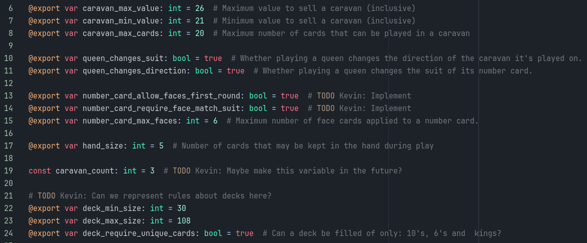

Karavane Spilleregler
--------------
Kortspillet Karavane spilles normalt mellem 2 modstandere,
hvor de medbringer hver sit dæk af 30-108 normale spillekort.
(Typisk kræves det at disse dæk sammensættes af kortene fundet i 2 normale sæt af spillekort.
Hvilket forhindrer at spillere medbringer ene 10'ere, for eksempel).

Vinde/Tabe
^^^^^^^^^^^^^^

Den eftertragtede måde at vinde spillet er ved at lægge værdien af hver af sine 3 karavaner mellem 21-26 (inklusiv) (og hermed "sælge" dem).
Samtidigt skal ens karavane også overbyde (have en højere værdi end) modstanderens overstående karavane.

I tilfælde hvor 2 overstående karavaner står lige (har samme værdi), vil dette forhindre spillet i at slutte.

Dog er spillet lavet således at det er tilstrækkeligt at én af hver af de modstående karavaner sælges.
Hermed vinder spilleren som har solgt flest 2/3 karavaner.

Spiller man sit sidste kort uden at vinde, taber man automatisk spillet.

Numeriske Kort
^^^^^^^^^^^^^^
Numeriske kort er de typisk spillede kort,
som bygger den numeriske værdi af karavanen hvorpå de spilles.
Numeriske kort adderer deres skrevne værdi til karavanen
(spillet man en 10'er, øges karavanens værdi med 10).

Esset tildeles en numerisk værdi af 1, og tjener kun et specialt formål i sammenspil med en joker.

Under ingen omstændigheder kan 2 kort af samme numeriske værdi spilles på hinanden.
Derfor vil karavaner med mindst 2 kort spillet tildeles en retning (stigende/faldende).
Herefter er det, som udgangspunkt, ikke muligt at spille numeriske kort som bryder denne retning.
Retningen kan dog vendes ved enten at spille en dame (på det nederste numeriske kort),
eller ved at spille et numerisk kort af samme (effektive) kulør (som det nederste numeriske kort).

Karavanens retning følger derfor retningen sat af de 2 nederste numeriske kort.

Ansigtskort
^^^^^^^^^^^^^^
Ansigtskort kan spilles på et hvert numerisk kort (sine egne, såvel som modstanderens),
hvorefter de yder specialle formål.
Det er muligt at spille flere ansigtskort på samme numeriske kort.

* Knægt
    Når knægten spilles på et numerisk kort, fjernes dette kort fra spillet (og dermed alle ansigtkort spillet derpå).

* Dame
    Damen ændrer den effektive kulør af kortet hvorpå hun er spillet,
    samtidig med at hun også ændrer retningen af karavanen (hvis spillet på det nederste kort).

* Konge
    Kongen fordobler værdien af kortet hvorpå han er spillet.
    Hvis flere konger spilles på samme numeriske kort, ændres værdien multiplikativt (9, 18, 36, 72).

* Joker
    I en vis forstand fungerer jokeren som en modsætningen af knægten.
    Når en joker spilles på et numerisk kort,
    fjernes alle andre kort, af samme numeriske værdi, fra alle karavanerne i spillet.

    Spiller man en joker på et es, fjernes alle andre kort med samme kulør (som esset) i stedet.

Projektet her pastræber sig at kunne tilpasses spillerens ønskede spilleregler.
Til dette formål findes klassen GameRules, som besidder en række variable som påvirker spillereglerne.
Denne klasse kan instantieres forskelligt for de 2 spillere,
og kan dermed udjævne færdighedsniveauforskelle mellem spillerne (tillade én spille 6 kort på hånden, for eksempel).

