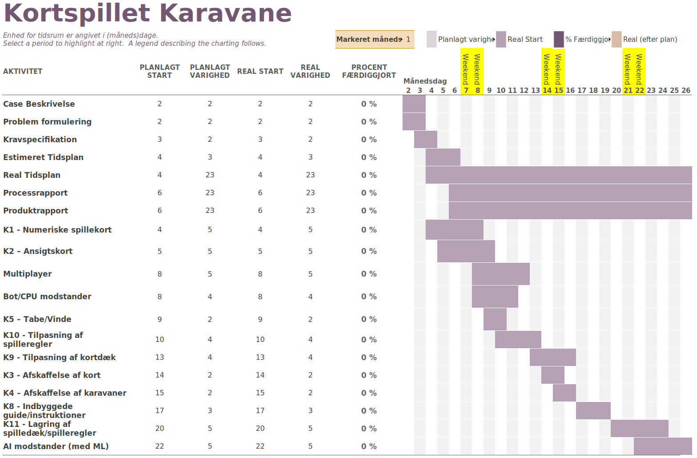

.. |module_image| image:: ../campaigncaravangame/CardTextures/joker_courier.jpeg
    :width: 8cm

Læsevejledning
----------------------------------------
I visse tilfælde vil denne rapport gøre brug af supplementerende internetlinks.
I tilfælde hvor læseren ønske følge disse links, bedes de venligst benytte en aktiv internetforbindelse.

Indledning
------------------------
Denne procesrapport er skrevet i sammenhæng med svendeprøveprojektet på H6PD091124.

Procesraporten dækker udvikling af min selvstændige udgave af kortspillet Caravan (fra videospillet Fallout New Vegas).
Raporten inkluderer overvejelser vedrørende projektet teknologier og primære alternativer dertil.

Visse dele af dene procesrapport, især teknisk dokumentation, vil også kunne findes i den tilhørende produktraport.

Case Beskrivelse
------------------------
.. include:: case_beskrivelse.rst

..
    _:: Problemformulering er inkluderet i case_beskrivelse.rst, og er derfor ikke et kapitel her

Afgrænsning
^^^^^^^^^^^^^^^^^^^^^^^

Allerede kort tid efter projektet startede,
havde jeg besluttet mig, at det ikke var en nødvendighed med flere forskellige typer modstandere.
Det har været min prioritet at lave et produkt som er klart til brug.
Med andre ord har hensigten været at spillet selv er klart til drift direkte efter svendeprøven.
Så polering har haft en hvis prioritet over omfang.
Med hensyn til modstandere er det dog vigtigt for mig,
at spillet er åben for udvidelse med flere typer i fremtiden.

Estimeret Tidsplan
------------------------

Valg af teknologier
------------------------

Godot
^^^^^^^^^^^^^^^^^^^^^^^^^^

Som kerneteknologi for projektet ligger Godot,
som er et gratis, open-source, spiludviklingsværktøj.

Spil i Godot bygges som en sammensætning af _scener_, som i sig selv er en sammentætning af _noder_.
Noder kan være så simple som funktionsløse geometriske former, disse former kan både bruges i spilverdenen,
men kan også bruges til at konstruere den grafiske brugerflade.
Mere avancerede noder tilknyttes et script,
hvilket giver en stor liste af muligheder for hvordan denne node kan kommunikere med,
og påvirkes af, andre noder i spillet.

Når noder sammensættes på en genbruglig måde, kan de gemmes som en scene.
Et godt eksempel på en scene kunne være en bil.
En bil vil sandsynligvis have forskellige noder til hvert hjul og chassiset.
En scene vil derfor sikre at alle bilens hjul medfølger, når man laver en instans deraf.
I tilfælde hvor man ønsker fremhæve variable til tilpasning af instanser (af noder/scener),
kan variable (klassefelter) annoteres med "@export" (i GDScript).
Denne annotering synliggører den påvirkede variabel i Godot's grafiske brugerflade,
samtidig med at den kommunikerer at variablen er egnet til ændring af brugeren af klassen. 

Set udefra (fra andre noder/scener) forekommer scener instanser som instanser af deres yderste/rod-node.
Og vil derfor også forkomme som instanser af klassen defineret deri.

Godot's scene arkitektur har dog en væsentlig ulempe, set fra det klassiske objektorienterede perspektiv.
Scener i Godot (GDScript) kan ikke tilknyttes en constructor.
I stedet er meningen at man går den gammeldags "C" vej,
og laver sin egen constructor funktion,
som man skal huske at kalde i stedet.
Det mystiske er at man alligevel godt kan lave klasser med parameteriserede konstruktøre,
men hvis sådanne klasser indgår som (under)noder i en scene, bliver konstruktøren ikke kaldt.

I typisk objektorienteret programmering er en klasses konstruktør et vigtigt punkt,
hvor der sikres at klassen tildeles nødvendighederne for dens funktion.
Typisk vil dette tage sted i form af dependency injection,
hvor der sikres at klassen ikke kan instantieres uden at blive tildelt objekter som kan afdække nødvendige ansvarsområder.
Yderligere er konstruktøren et naturligt punkt at udføre fornuftighedstjek mellem metodens argumenter,
og dermed sikre en samhørighed til klassens funktion.

**Design Patterns velgenet til Godot**

"Design Patterens" (i forhold til programmering) er en række typiske anvendte teknikker,
hvor brugen deraf giver et fagsprog som gør det lettere at beskrive problemstillinger og løsninger dertil.
Begræbet "Design Patterns" blev først introduceret af:
`Erich Gamma <https://en.wikipedia.org/wiki/Erich_Gamma>`_, `Richard Helm <https://en.wikipedia.org/wiki/Richard_Helm>`_,
`Ralph Johnson <https://en.wikipedia.org/wiki/Ralph_Johnson_(computer_scientist)>`_ og `John Vlissides <https://en.wikipedia.org/wiki/John_Vlissides>`_,
i deres (1994) bog `Design Patterns: Elements of Reusable Object-Oriented Software <https://en.wikipedia.org/wiki/Design_Patterns>`_.
Den "fulde" liste af Design Patterns kan findes her: https://refactoring.guru/design-patterns

* Observer Pattern
    Godot's brug af Observer mønstret kaldes "Signals".
    Her kan en klasse/node definere en række signaler som den er i stand til at udsende.
    Hvorefter "lyttere" kan forbinde metoder som skal køres når signalet udsendes.
    Signaler kan defineres med argumenter,
    som herefter skal udfyldes ved udsendelse,
    og lytterfunktioner skal parameteriseres så de kan modtage disse argumenter.
    Hvilke argumenter et signal videregiver, afhænger meget af signalets formål.
    Men ét typisk argument er "self", hvilket tillader en lytter at forbinde til mange afsendere,
    og herefter bruge argumentet til at referere tilbage til kilden af signalet.

    Sandsynligvis er disse signaler implementeret som en liste af funktionsreferencer,
    som kaldes i rækkefølge af signalets .emit() metode.

    Godot's brugerflade er meget nyttig til at forbinde disse signaler.
    Her kan man under "Node" fanen (øverst til højre, ved siden af "Inspector" fanen),
    og derefter "Signals", vælge hvilke signaler man gerne vil lytte på.
    Herefter har man mulighed for vælge lytteren, ved enten at vælge en funktion eller definere en ny.
    
    Men i tilfælde hvor noder kreeres dynamisk, kan det være udfordrende at forbinde deres signaler.
    Heldigvis kan lytteren (af signalet) ofte videregive sig selv til udsenderen, vha. Dependency Injection,
    og dermed sikre at lyttermetoden bliver kaldt.

* Dependency Injection
    Spillets mest markante brug af dependency injection, er formentlig med GameManager.restore_hook,
    Denne funktionspointer kan tilpasses af brugeren af klassen, hvorefter funktionen kaldes når karavanespillet genstartes.
    Denne funktionspointer bruges af hovedmenuen, som ønsker at tilpasse 2 CPU spillere, til at spille mod hinanden.
    Derfor udfylder hovedmenuen denne funktion, og bruger den til at tildele en CPU spiller instants til den nederste spiller,
    som ellers vil være styret af den menneskelige spiller.

**Programmeringssprog supportereret af Godot**

Godot supporterer flere forskellige programmeringssprog:

* GDScript
    Godot er selv skrevet i C++, men typisk skrives spil deri i deres scripting sprog GDScript.
    GDScript minder på mange måder om Python, potentielt blandet med lidt JavaScript.
    GDScript filer kendetegnes med filentypen .gd, og knyttes oftest direkte til såkaldte "Noder" i spillet.
    Når man knytter et .gd script til en node, bliver den node en instans af klassen som man definerer i .gd filen.

    Så trods det er svært at se i script filerne, er GDScript meget objektorienteret.
    Hver .gd script udgør præcis én klasse, hvilket bliver meget tydligere at se hvis man inkluderer nøgleordet "class_name <Name>" deri.

    GDScript har dog sine begrænsninger i forhold til de traditionelle objektorienteret programmeringssprog.
    Ligevidt som C# og Java, understøtter GDScript _ikke_ multipel nedarvning. Dette faktum overkommer C# og Java med interfaces.
    GDScript har dog ikke interfaces, i den traditionelle forstand,
    og afhænger i stedet af "duck typing" til at løse mere indviklede nedarvningshierarkier.

* C#
    Som de primære alternativ til GDScript, tilbyder Godot også et C# API.
    C# APIet ser stærkt støtte fra Godot's udviklere,
    men nogle enkelte mangler viser at GDScript stadig har førsteprioritet.

    C# API'et er dog nok stadig et godt valg, når man vil prioritere ydeevne og en skalérbar kodebase.
    Men med Caravan's lave krav om ydeevne, og med mit ønske om at køre spillet på flere platforme,
    følte jeg det mere passende at forblive uafhængig af en .NET runtime.
    Her skal jeg dog nævne at det, efter min forståelse,
    er muligt at eksportere sit Godot/C# spil med en Mono runtime inkluderet.

    Mono er en open-source implementation af .NET standarden,
    som med årene har set mere støtte fra Microsoft.

    Min personlige holdning af C# har ændret sig meget i løbet af min uddannelse som Datatekniker.
    I den tid jeg har været elev der, har Tech College været stærkt integreret med Microsoft økosystemet.
    .NET sprogene har derfor, naturligvis, haft førsteprioritet.
    Derfor startede min viden om programmering med C#,
    hvor det fandt det utroligt at sproget kunne skrive "Hello World!" i mit konsolvindue.
    Efter omkring et halvt år på GF1 havde jeg langsomt begyndt at forstå fidusen bag Objektorienteret Programmering,
    men jeg undrede mig stadig over "static void Main(string[] args)".
    For mig passede nøgleordet "static" ikke ind i et objektorienteret programmeringssprog.
    Hvorfor skal jeg definere "class Program {...}", når "static void Main(string[] args)" ikke er bundet til nogen instans deraf?

    Herefter blev jeg introduceret til Python, og var totalt forbløffet over hvor nemt alting var.
    Det føltes som om jeg blev givet snyderkoder.
    Python er også lidt speciel i den forstand at det understøtter Objektorienteret Programmering,
    men det er ikke et krav.
    Og for mig gav det bare meget mere mening. Intet magisk "this" nøgleord, i stedet har du "self",
    som blot er en reference til en instans af klassen hvorpå metoden er defineret.
    Funktioner er ikke knyttet nogen instans, er har derfor hverken "this" eller "self".
    Samtidig gav det også bare meget mere mening at koden eksekverer fra toppen,
    linking og symbol afvikling er meget nemmere at forstå,
    når man kan sætte et breakpoint i sit script og se hvordan/hvornår symboler opdages.

    I starten kendte jeg ikke til Python's type-hinting syntax,
    så selvfølgelig brugte jeg det heller ikke.
    Men jeg var så glad for Python, at jeg ville simpelthen bare lære alt om sproget.
    Så det varede ikke længe inden alle mine variable havde type-hints.
    Et faktum som også gjorde PyCharm's liv meget nemmere, for ikke at tale om mit eget.
    De gjorde det meget nemmere at knytte APIer i mere komplekse programmer.

    Det var nok heromkring hvor jeg begyndte at tilgive C#.
    Det betyder ikke at jeg har tænkt mig at kode i sproget.
    Jeg har arbejdet utroligt meget med generics og reflection i Python,
    hvor C#'s reflection wrapper API utroligt klodset forholdsvis.
    Og jeg fandt heller ikke skolens introduktion til Entity Framework specialt imponerende,
    efter at have arbejdet med Django's ORM.

* C/C++
    Som sagt er Godot selv skrevet i C++, det er derfor naturligt af de tilbyder et API til dynamisk linking af biblioteker.

    Eftersom at Godot er open-source, kan man også skrive sine udvidelser/rettelser direkte i kildekoden.
    Dette kræver dog en rekompilering af selveste Godot, hvilket kan gøre udviklingen væsentligt mere tidskrævende.

    Allerede inden opstart af projektet var jeg ude og undersøge Godot's udviklingsmuligheder indenfor C/C++.
    Min tid ved Space Inventor har jeg gjort godt tilpas med C, og jeg så det derfor, på daværende tidspunkt,
    som en fin udfordring at bruge den viden til projektet.
    Men jeg ombestemte mig ved næremere eftertanke,
    da jeg så det som en højere prioritet at udvikle spillet på en cross-platform manér.
    Det er nemlig min forståelse at brugen af C/C++ APIerne udfordrer Godot's lange række af indbyggede cross-platform eksporteringsmuligheder.

Det kan dog siges at Godot lever i skyggen af sine væsentligt mere velkendte konkurrenter: Unity og Unreal.
Godot så dog et stort fremspring af både financial og moralsk støtte,
da Unity indførte en række kontroversielle ændringer til deres servicevilkår i Q4 af 2023.

For mig var én af Godot's store salgspunkter muligheden for at eksportere til HTML5.
Jeg ser det som en kæmpe fordel at kunne hoste spillet som en server,
og blot inkludere et link dertil i disse rapporter.

**Alternativer**

* Unity
    Unity står som én af de 2 kæmper inden for spiludviklingsværktøjer.
    Og trods de tidligere nævnte kontroversielle ændringer til deres servicevilkår i Q4 af 2023,
    er Unity stadig ofte brugt til udvikling af mere krævende spil.
    Unity's omry er også som mere begyndervenlig end Unreal.

    Unity spil skrives i C#, og er derfor afhængig af en .NET runtime.
    Denne afhængighed tillader dem dog at køre på på flere platforme.

    Unity er gratis til udvikling af ikke-kommericelle spil.

* Unreal
    Unreal står som den anden kæmpe af spiludviklingsværktøjer.

    Unreal's omry er som mere avanceret end Unity.
    Dette giver muligheder for bedre ydeevne, men gør også værktøjet mindre begyndervenligt.

    Som hjemmel til det skræmmende omry skrives Unreal spil, som udgangspunkt, i C/C++.
    Men som alternativ hertil tilbyder Unreal deres grafiske programmeringsværktøj "Blueprints":

    .. image:: Pictures/Unreal_Blueprints.png
        :width: 75%

    Kilde: https://dev.epicgames.com/documentation/en-us/unreal-engine/blueprints-quick-start-guide?application_version=4.27

Jeg har primært valgt Godot grundet min tidligere, dog begrænsede, erfaring på H5PD010124.
Trods GDScript's begrænsninger synes jeg generelt godt om sproget, med en syntaks som er nem at forstå.
Men min primære motivation bag valget af Godot, er dets letvægtige og open-source natur,
samt muligheden for at eksportere til mine ønskede platforme.
Jeg ønsker at se Godot brillere, og følger derfor somme tider op på dets udvikling.
Her ser jeg et godt initiativ både inden for brug og udvikling deraf.
Dog er Godot stadig mindre populært end alternativerne,
og dette viser sig når fejlfinde et obskurt problem.

Database
^^^^^^^^^^^^^^^^^^^^^^^^^^
Jeg har følt det vigtigt at produktets vedligeholdelse ikke påtvinges unødvendige services,
alligevel har jeg endda selv haft et ønske om persistent lagring.
Godot har indbygget persistent lagring af Resource underklasser,
men i ære af svendeprøven har jeg påtaget med udfordringen ved et relationel database.

Dog er valget af "Godot kompatible" løsninger hertil forholdsvis tyndt,
hvis man fravælger en ekstern database server.

Mit ønske har været at indlejre en SQLite database,
og dermed flytte den persistente lagring til klienterne.
Hermed holdes spillet uafhængigt af eksterene tjenester,
som kan siges at tildele en udløbsdato til spillet.

Til dette formål findes et par enkelte projekter,
hvoraf det mest opdaterede kan findes her:
https://github.com/2shady4u/godot-sqlite

**Godot-SQLite**

    *Bemærk venligst at dele af denne beskrivelse også forekommer i produktrapporten.*

    .. include:: godot-sqlite_generic.rst

    .. end of generic Godot-SQLite description.

    Repoet til godot-sqlite nævner at HTML5 er understøttet.
    Men en nærlæsning viser at det, indtil videre, kun er tilfældet med en ældre version af Godot.
    Og selv dér er det ustabilt og browser afhængigt (Vivaldi nævnes som et pragteksemplar).

    Ligeledes som jeg, har ejeren af godot-sqlite repoet udrullet et brug deraf til GitHub Pages:
    https://2shady4u.github.io/godot-sqlite/

    Denne side fejler på samme måde som min, nemlig med fejlbeskeden:
    "Uncaught (in promise) LinkError: imported function 'env._ZNSt3__29to_stringEx' signature mismatch" i (browser) konsollen.
    Her har det i det mindste været en lille trøst, at det ikke kun er mit projekt som lider af fejlen.
    Denne specifikke fejl er en regression fra den tidligere version af godot-sqlite.

    Godot-sqlite opdateres stadig jævnligt. Derfor har jeg endnu håb,
    om at databasen kan indlejres i webserveren i den nærmere fremtid.

    Som en midlertidig løsning, har jeg lavet en version af spillet uden mulighed for at tilpasse kortdæk.
    Denne version bruges derfor af HTML5 varianten af spillet.

Produktetrapportens afsnit **database** forklarer hvordan disse teknologier er inkorporeret i spillet.

Havde jeg haft omkring en uges ekstra tid,
ville jeg også have prioriteret at lave en tabel (og tilsvarende bruger)
til at gemme sæt at spilleindstillinger (tilsvarende til GameRules klassen).
Denne tabel har ikke været en prioritet med den nuværende tidsplan,
da jeg stadig har planer om udvidelse og tilpasning af GameRules klassen.
Følgende er et udkast af denne tabel (på baggrund af GameRules nuværende struktur):

Distribution og Hosting
^^^^^^^^^^^^^^^^^^^^^^^^^^

Når det kommer til hosting, fortrækker jeg at gøre det "in house" (i mit teknikrum).
Men kort tid inden projektets opstart hørte jeg for første gang om brugen af GitHub Pages til dette.

GitHub Pages tillader hosting direkte fra et repository.
Typisk/traditionelt fungerer dette ved at man vælger en branch,
er herefter serveres det nyeste commit på denne branch direkte til det valgte URL.
URLet vil som standard være et underdomæne af GitHub,
men er man ejer af et CNAME kan repoet serveres dér i stedet.
Som alternativ til 'branch' servering,
kan man benytte en Jekyll GitHub Action til at generere indholdet som ønskes serveres.

**Brug af GitHub Workflows**

    Dette projekt benyttede sig i starten af Jekyll til automatisk udrulning af opdateringer.
    Men den brugte (autogenerede) GitHub var ikke tilpasset til udgivelse af Linux og Windows versionen af spillet.
    Derfor skiftede jeg senere til 'branch' udrulning, da jeg fandt et godt eksempel på et GitHub workflow til Godot.

    Havde jeg haft mere tid, er det muligt at jeg vil have forsøgt at kombinere Jekyll med Godot workflowet.
    Som det står an nu, har jeg forsøgt at minimere eksperimentationen af GitHub actions,
    da Godot's terminal interface har vist sig at være forholdsvis ustabilt.

    Når Godot skal gøre brug af ressourcer som billed- og lydfiler, opretter den en .import fil,
    som indeholder metadata vedrørende (f.eks) komprimering af ressourcen.

    Desværre virker oprettelsen (og den lejlighedsvise tilrettelse) af disse metafiler kun pålidelig gennem den grafiske brugerflade til Godot.
    Dette har været den primære udfordring ved GitHub workflowet.

    Derudover har godot-sqlite også besværliggjort GitHub workflowet,
    da det viser sig at kompilering af spillet, med godot-sqlite inkluderet, resulterer i en segmentationsfejl.
    Dette sker ikke via brug af den grafiske brugerflade, og viste sig derfor først i GitHub workflowet.
    Heldigvis har det vist sig at segmentationsfejlen sker efter spillet er kompileret og binæren produceret.
    Desværre stopper dette GitHub fra at fuldføre workflowet, så derfor sletter artifakterne.
    Dette problem løses enkeltvis ved brug af en kommando som forhindrer fejlkoden fra kompileringen:

    .. code-block:: sh

        godot [options...] --export-debug "HTML5" ../build/... || echo ""

    Her bruges **echo** som en kommandoen som altid lykkedes, når **godot --export-debug "HTML5" ../build/...** fejler

GitHub Pages begrænser sig til statisk serveret indhold,
og egner sig derfor ikke til den alemene webserver som gør brug af serversidet rendering (asp.NET, Django, osv.).

Men heldigvis for dette projekt, kan Godot spil eksporteres som en HTML5 PWA (Progressive Web App).
Forenklet sagt betyder dette at hjemmesiden serveres i sin helhed, med alt underindhold.
Denne statiske hjemmeside kan dog stadig kommunikere op imod et web-API.
Men herefter er det, som udgangspunkt, hjemmesidens eget ansvar at tilpasse visningen til det modtagede indhold.
Det modtagede indhold vil dog ikke indeholde den klassiske HTML rodstruktur, og dette kendetegner en PWA.
I modsætning vil den traditionelle hjemmeside modtage hele HTML strukturen for hver forespørgsel.

Realiseret tidsplan
------------------------

.. TODO Kevin: Include tidsplan

Inden jeg havde startet udviklingen af spillemodstandere,
havde jeg svært ved at vælge/prioritere mellem menneskelige kontra CPU modstandere.
Men efter jeg fik implementeret funktionen "func get_legal_slots(hand_card: CardHandSlot) -> Array[CaravanCardSlot]",
blev det åbenlyst for mig hvor nemt det ville være at implementere en simpel ("tilfældig") algoritme som modstader.
Efterfølgende gik det også op for mig at de var således jeg oftest brugte den tidligere hjemmeside variant.
Jeg ser Caravan som et godt spil, når man har en smule tid man skal have brændt af.
Og herved er det nemmest hvis ikke man behøver arrangere en runde med et andet menneske.

Som forklaret i afgrænsningen, har det ikke været en prioritet at implementere flere typer modstandere.
På tidsplanen ses denne beslutning som en forskydelse af startdatoen på de påvirkede opgaver (K6 specialt).
I kravspecifikationen er de forskellige typer modstandere flettet til ét krav.

Test Metodik
------------------------

Spillet har primært været testet med integrationstest, hvor 2 CPU spillere sammensættes som modstandere.
Hermed har de haft mulighed for at kalde det fulde sæt af spillekort API(er), ligeledes som en menneskelig spiller.
Spillets kildekode gør stor brug af både `Defensive programming <https://en.wikipedia.org/wiki/Defensive_programming>`_ og `Offensive programming <https://en.wikipedia.org/wiki/Offensive_programming>`_.

På nuværende tidspunkt har spillets kildekode ~222 return "kald", og ~122 assert() kald.

Mange af spillets markante APIer, gør brug af det følgende format:

.. code-block:: GDScript

    func _play_face_card(hand_card: CardHandSlot, animate: bool = true) -> void:
        assert(*.state_is_good)
        ...

    func can_play_face_card(hand_card: CardHandSlot) -> bool:
        
        if (...):
            return false

        if (...):
            return false

        return true

    func try_play_face_card(hand_card: CardHandSlot, animate: bool = true) -> bool:
        if not self.can_play_face_card(hand_card):
            return false
            
        self._play_face_card(hand_card, animate)
        return true

Mange dele af spillet har behov for at teste hvor vidt det er muligt at kalde bestemte API(er),
uden af faktisk kalde nævnte API.
F.eks når spilleren løfter et kort med musen, her skal brugerfladen opdateres, og vise hvor kortet kan lægges.
Her kan det pågældende script kalde (f.eks) **can_play_face_card()**.

I samme sammenhæng håndterer CPU spillerne de utallige kombinationer
af spilindstillinger ved at kalde (f.eks) **try_play_face_card()**.
Som set i kodeeksemplet ovenfor, vil denne funktion returnere **false** når dette ikke er tilladt eller muligt.
Dette informerer botten om at deres ønskede korttræk ikke er muligt,
og at de skal forsøge deres nærmest ønskede korttræk i stedet.

Når **can_play_face_card()** lykkes, forsætter eksekveringen til det interne API (f.eks) **_play_face_card()**.
Dette API gør tungt brug af **assert()**, og lader sig ikke byrdes af pæn propagering af fejltilstande.
Dette er som sagt **can_play_face_card()'s** arbejde.

Et eksempel på en funktion som kombinerer både `Defensive programming <https://en.wikipedia.org/wiki/Defensive_programming>`_ og `Offensive programming <https://en.wikipedia.org/wiki/Offensive_programming>`_,
kan ses i **func get_caravan_sold_status(caravan: Caravan) -> SoldStatus**.
Denne metode starter med guard clauses til at tjekke om den givne karavane er over- eller underbyrdet.
Hvis ikke; er det nødvendigt at konsultere det større spilstadie, for at se hvor vidt karavanen står lige men den over for sig.

.. code-block:: GDScript

    ## Check if the provided caravan is sold.
    ## This entails checking if the caravan is:
    ##	over/under-burdened, underbidding or tied with the opponent
    ## It might initally seem that this method should exist on the Caravn class,
    ##	but the Caravan is only loosly coupled to the larger game state.
    ##	So it has no concept about opponent caravans.
    ##	Which is needed to determine if a caravan has been outbid, or is tied.
    func get_caravan_sold_status(caravan: Caravan) -> SoldStatus:

        if caravan.get_value() < caravan.player.game_rules.caravan_min_value:
            self.notify_opponent_caravans(caravan)
            return SoldStatus.UNDERBURDENED
        elif caravan.get_value() > caravan.player.game_rules.caravan_max_value:
            self.notify_opponent_caravans(caravan)
            return SoldStatus.OVERBURDENED

        for player in self.players:
            assert(player is Player)

            if player == caravan.player:
                continue  # No need to check if we are outbidding our own caravan

            # TODO Kevin: Are we comfortable using the index to check for tied caravans.
            var opponent_caravan: Caravan = player.caravans[caravan.player.caravans.find(caravan)]
            if opponent_caravan.get_value() > caravan.player.game_rules.caravan_max_value:
                continue  # The opponent caravan is overburdened (Using our rules)

            if opponent_caravan.get_value() > caravan.get_value():
                # Opponent caravan must be sold, because it is outbidding us, without being overburdened
                assert(opponent_caravan.get_value() in range(opponent_caravan.player.game_rules.caravan_min_value, opponent_caravan.player.game_rules.caravan_max_value+1))
                # TODO Kevin: Maybe this is a bit spaghetti,
                #	but we need to tell the other caravan, that it is outbid now.
                opponent_caravan.update_sold_status(SoldStatus.SOLD)
                return SoldStatus.OUTBID
            elif opponent_caravan.get_value() == caravan.get_value():
                # TODO Kevin: This is just as spaghetti as the outbid situation.
                opponent_caravan.update_sold_status(SoldStatus.TIED)
                return SoldStatus.TIED
            elif caravan.get_value() > opponent_caravan.get_value():
                # Tell the opponent caravan that we just outbid it (Yes; this is also spaghetti)
                opponent_caravan.update_sold_status(SoldStatus.OUTBID)

        # Success!
        return SoldStatus.SOLD

Konklusion
------------------------

Det er meget muligt a rekreere kortspillet Caravan i selvstændigt format.
Med spilmoteren Godot kan spillet let laves cross-platform,
hvorved det bliver væsentligt lettere tilgængeligt for potentielle spillere.
Godot tilbyder flere måder hvor brugerdata kan lagres persistent,
men ønskes brugen af en centraliseret relationel (SQL) database,
skal der enten gøres brug af SQLite, eller vedligeholdelse af endnu en service.

.. TODO Kevin: Move the section below to somewhere where it's more fitting.

**Vejledning af Spilleregler i spillet**

    Caravan har et ry blandt Fallout New Vegas' spillere om a være meget forvirrende og kompliceret.
    I søgen om at gøre min udgave af kortspillet så forståligt som muligt,
    har jeg været meget interesseret i årsagen bag forvirringen.

    Derfor har jeg været specialt interesseret i førstehåndindtryk af begge udgaver af spillet.
    Desværre har jeg ikke nået at observere førstehåndintryk af min udgave personligt,
    men det lykkedes mig at finde en youtuber spille hendes første spil af udgaven i Fallout:

    https://www.youtube.com/watch?v=yD_lWpDgcUQ&list=PLZIrkWszSEEM_ywEah_f8G4-oePaGweG1&t=1832s

    Dette har givet mig en god forståelse af hvorfor den originale udgave er svær at forstå:

    #. 
        Fallout giver en overordnet, utilstrækkelig, forklaring af spillereglerne.
        Herefter gives en note med den uddybede forklaring.
        Men spilleren inviteres til deres første spil,
        inden de har mulighed for at læse spillereglerne.

    #. 
        Accepterer spilleren invitationen til spillet,
        bliver de præsenteret med brugerfladen til at konstruere deres kortdæk.
        Dette er inden de har lært betydningen bag de forskellige kort.
        Heldigvis er det nemt for brugeren at vælge alle, eller tilfældige, kort her,
        men sandynligvis er denne brugerflade alligevel ikke betryggende for spilleren.

    #. 
        Herefter starter selveste spillet, og spilleren kan begynde at placere kort.
        Når et kort løftes fra hånden, gives der ingen hentydning til hvor det er muligt at spille det.
        I stedet piltasterene til at flytte det valgte kort mellem alle pladser på bordet.
        Her er det, f.eks, muligt at flytte nummerkort til modstanderens karavaner,
        men en rød markering bruges til at vise at det ikke er muligt at spille kortet dér.
        Derfor skal spilleren søge efter pladser hvor det er muligt at spille deres kort.
    
    #. 
        Derudover giver den originale udgave ingen tilbagemelding når en karavane er solgt.
        Eller at spillets afslutning er forhindret af en uafgjort karavane.
    
    #. 
        I det mindste gives en rød markering på værdien karavanen efter den overskrider dens maksimale værdi.
        Men da denne tilbagemelding gives efter at kortet er spillet,
        er det muligt at spilleren vil spille kort indtil de tilfældigvis overbyrder deres karavane.

    #. 
        Samtidigt gives der heller ingen tilbagemelding på hvilke kort en joker vil fjerne.
        Og derfor virker det tilfældigt når den fjerner halvdelen af bordet.

    #. 
        Når et kort fjernes, animeres karvanen (fra det nederste til det fjernede kort) ud ad skærmen.
        Hvorefter den animeres tilbage på plads uden det fjernede kort.
        Dette kan gøre det svært at se præcist hvilket kort som fjernes.

-----------------------------------

    Produktrapporten uddyber hvordan min udgave forsøger at gøre spillereglerne nemmere at forstå.

Refleksioner
^^^^^^^^^^^^^^^^^^^^^^^^^^

    I modsætning til det tværfaglige projekt på H5PD010124,
    har vi på H6PD091124 haft langt mere mulighed for at arbejde hjemmefra.

    For mig har det specialt gjort mig mere effektiv om morgenen,
    hvor jeg ofte oplever den bedste koncentration.
    Hjemmefra kan jeg nemlig vågne med gode ideér at bruge dagen på,
    og med det samme arbejde på dem ved computeren.

    Desuden brillerer min stationære arbejdsstation herhjemme også over bærebaren som medbringes til skolen.
    (Dog skal det siges at skolen supplerer os med ekstra skærme, og dette er en stor hjælp).

    I visse tilfælde kan koncentration dog udfordres på hjemmekontoret,
    især efter en given indsats på dagens opgaver.
    Det samme kan dog siges på skolen.
    Så som helhed vil jeg mene at jeg arbejder bedst hjemmefra.

Den oprindelige udgave af denne rapport findes i .rst på GitHub her: https://github.com/kivkiv12345/CampaignCaravan/blob/master/docs/procesrapport.rst.

Bilag
----------------------------------

Logbog
^^^^^^^^^^^^^^^^^^^^^^^^^^

.. include:: logbog.rst
