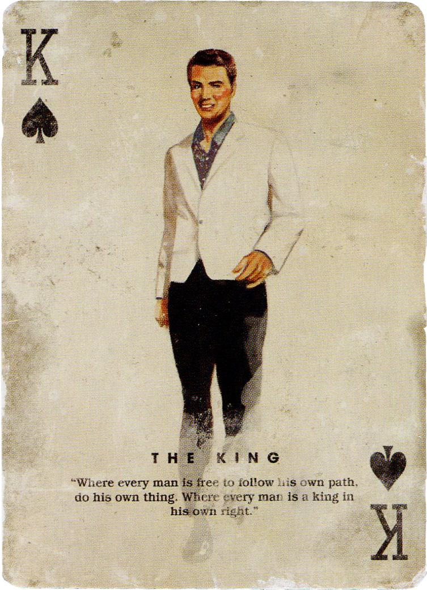
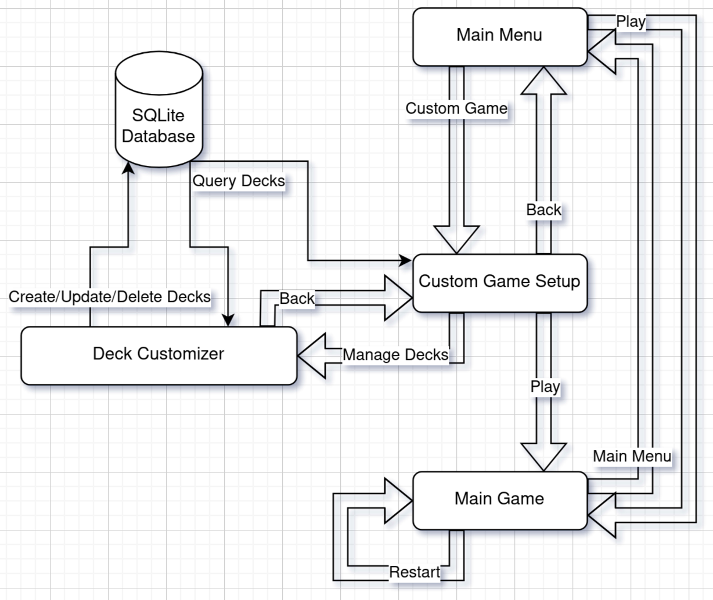
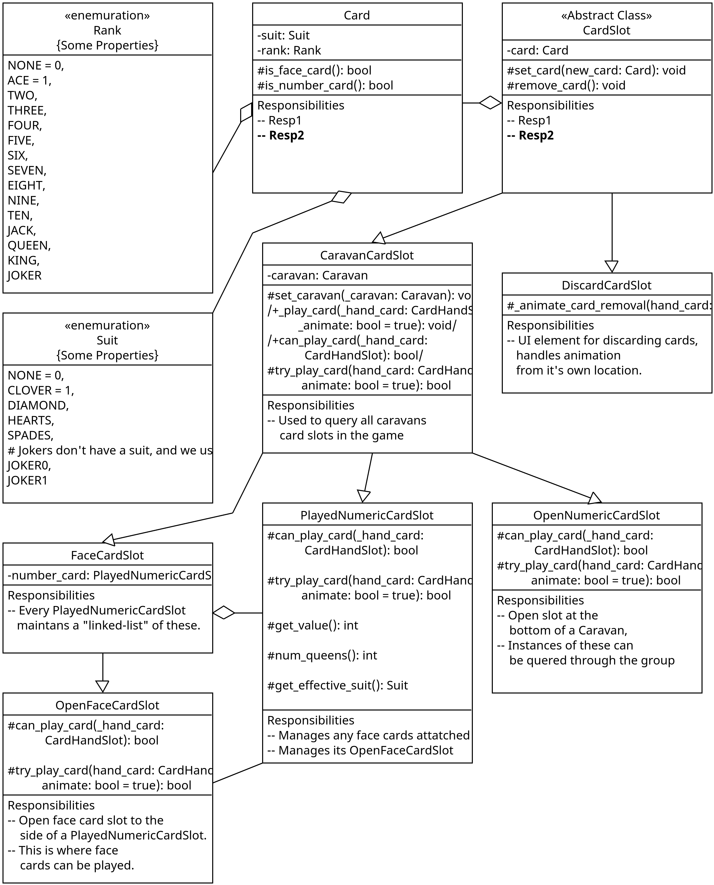

.. include:: secrets.rst

.. |num_pages| replace:: 19

.. |num_characters| replace:: ~29000 (.rst) - 43046 (.pdf)

Læsevejledning
----------------------------------------
I visse tilfælde vil denne rapport gøre brug af supplementerende internetlinks.
I tilfælde hvor læseren ønsker følge disse links, bedes de venligst benytte en aktiv internetforbindelse.

Procesrapporten har til formål af beskrive Campaign Caravan's udvikling,
hvorimod produktrapporten har til formål at beskrive spillets nuværende tilstand.

Størstedelen af tekonologierne nævnt i denne produktrapport er ydereligere beskrevet i den tilsvarende `procesrapport <https://github.com/kivkiv12345/CampaignCaravan/blob/master/docs/procesrapport.rst>`_ (link til .rst format).
For at forbedre læsbarheden vil enkelte tekster forekomme i begge rapporter, i disse tilfælde vil læseren gøres opmærksom på dette.

Kildekoden for produktet, og projektet som helhed, er tilgængelig på GitHub her:
https://github.com/kivkiv12345/CampaignCaravan

.. _`Overbliksdiagram - Grænsefladenavigation`:

Overbliksdiagram - Grænsefladenavigation
----------------------------------------

Kravspecifikation og Accepttest
----------------------------------------

.. include:: kravspecifikation.rst

Kernen bag accepttesten er at spillet opfylder kravene stillet af kortspillets Karavanes spilleregler.
Disse spilleregler ses nedenunder i afsnittet `Karavane Spilleregler`_:

.. raw:: pdf

    PageBreak oneColumn

.. _`Karavane Spilleregler`:

Karavane Spilleregler
^^^^^^^^^^^^^^^^^^^^^^^^^^^^

Kortspillet Karavane spilles normalt mellem 2 modstandere,
hvor hver medbringer et dæk af 30-108 normale spillekort.
(Typisk kræves det at disse dæk sammensættes af kortene fundet i 2 normale sæt af spillekort.
Hvilket forhindrer at spillere medbringer ene 10'ere, for eksempel).

**Numeriske Kort**

    Numeriske kort er de typisk spillede kort,
    som bygger den numeriske værdi af karavanen hvorpå de spilles.
    Numeriske kort adderer deres skrevne værdi til karavanen
    (spiller man en 10'er, øges karavanens værdi med 10).

    Esset tildeles en numerisk værdi af 1, og tjener kun et specialt formål i sammenspil med en `joker`_.

    Under ingen omstændigheder kan 2 kort af samme numeriske værdi spilles på hinanden.
    Derfor vil karavaner med mindst 2 kort spillet tildeles en retning (stigende/faldende).
    Herefter er det, som udgangspunkt, ikke muligt at spille numeriske kort som bryder denne retning.
    Retningen kan dog vendes ved enten at spille en dame (på det nederste numeriske kort),
    eller ved at spille et numerisk kort af samme (effektive) kulør (som det nederste numeriske kort).

    Karavanens retning følger derfor retningen sat af de 2 nederste numeriske kort.

**Ansigtskort**

    Ansigtskort kan spilles på et hvert numerisk kort (sine egne, såvel som modstanderens),
    hvorefter de yder specialle formål.
    Det er muligt at spille flere ansigtskort på samme numeriske kort.

    * Knægt
        Når knægten spilles på et numerisk kort, fjernes dette kort fra spillet (og dermed alle ansigtkort spillet derpå).

    * Dame
        Damen ændrer den effektive kulør af kortet hvorpå hun er spillet,
        samtidig med at hun også ændrer retningen af karavanen (hvis spillet på det nederste kort).

    * Konge
        Kongen fordobler værdien af kortet hvorpå han er spillet.
        Hvis flere konger spilles på samme numeriske kort, ændres værdien multiplikativt (9, 18, 36, 72, ...).

.. _`Joker`:

    * Joker
        I en vis forstand fungerer jokeren som en modsætningen af knægten.
        Når en joker spilles på et numerisk kort,
        fjernes alle andre kort, af samme numeriske rank, fra alle karavanerne i spillet.

        Spiller man en joker på et es, fjernes alle andre kort med samme kulør (som esset) i stedet.

.. raw:: pdf

    PageBreak oneColumn

**Vinde/Tabe**

    Den eftertragtede måde at vinde spillet er ved at lægge værdien af hver af sine 3 karavaner mellem 21-26 (inklusiv) (og hermed "sælge" dem).
    Samtidigt skal ens karavane også overbyde (have en højere værdi end) modstanderens overstående karavane.

    .. image:: Pictures/HowToWinBest.png
        :width: 50%

    Når en karavanes værdi er over 26, er den overbyrdet. I dette stadie hjælper den ikke med at vinde spillet.
    
    .. image:: Pictures/HowToWinOverburdened.png
        :width: 50%

    Dog er spillet lavet således at det er tilstrækkeligt at én af hver af de modstående karavaner sælges.
    Hermed vinder spilleren som har solgt flest (2/3) karavaner.

    .. image:: Pictures/HowToWin2Caravans.png
        :width: 50%

    I tilfælde hvor 2 overstående karavaner står lige (har samme værdi), vil dette forhindre spillet i at slutte.

    .. image:: Pictures/HowToWinTied.png
        :width: 50%

    Spiller man sit sidste kort uden at vinde, taber man automatisk spillet.

.. raw:: pdf

    PageBreak oneColumn

**Tilpasninger af Spilleregler**

    Projektet her pastræber sig at kunne tilpasses spillerens ønskede spilleregler.
    Til dette formål findes klassen GameRules, som besidder en række variable som påvirker spillereglerne.
    Denne klasse kan instantieres forskelligt for de 2 spillere,
    og kan dermed udjævne færdighedsniveauforskelle mellem spillerne (tillade én spiller 6 kort på hånden, for eksempel).

    .. image:: Pictures/GameRules.png
        :width: 85%

    Disse tilpasninger kan fortages grafisk, gennem brugerfladen, ved hjælp af `spilopsætningsmenuen`_.

Teknisk produktdokumentation
-----------------------------------

Godot
^^^^^^^^^^^^^^^^^^^^^^^^^^^^

Noder i Godot kan tildeles grupper, og dog det desværre ikke compile-sikres, vil noderne i disse grupper typisk følge et bestemt API.
Derfor kan det siges at disse grupper kan bruges som interfaces kendt fra traditionelle objektorienterede sprog.
Tildeler man grupper til en node i en scene, vil alle instanser af denne scene og også tildeles til disse grupper.
Derfor bliver det muligt at forspørge og iterere alle instancer af underscener.
Det kan dog siges at gruppesystemet har et svagt punkt, i at referencer til grupper er strengbaseret på gruppens navn.

Gruppesystemet er en god måde af afkoble kode,
og Campaign Caravan bruger det meget til at finde de forskellige klasseinstanser.
Til dette formål definerer spillet de følgende klasser:

- CaravanDiscardButtons

- Caravans

- CardSlots

- FaceCardSlots

- NumericCardSlots

- OpenCardSlots

Noder kan sagtens være medlem af grupper, f.eks tildeles OpenFaceCardSlot både: CardSlots, FaceCardSlots, OpenCardSlots.

Spillets kodebase gør brug af et arvehierarki til at differentiere de forskellige kort pladser i spillet.
Dette arvehierarki kombineres med Godot's "group" funktionalitet.
Kombinerer man disse, kan forekomsterne af kort pladserne forspørges og itereres.

Arvehierarki ses på UML diagrammet nedenunder.

Database
^^^^^^^^^^^^^^^^^^^^^^^^^^^^

Campaign Caravan gør meget bevidst ikke brug af en ekstern database server.
Dette valg er for at sikre at spillet så vidt muligt forholder sig uafhængig af eksterne tjenester.
Sådanne eksterne tjenester kan ikke vedligeholdes for evigt, og tildeler derfor en udløbsdato til spillet.

I stedet har spillet indlejret en SQLite database, som håndterer alt persistent lagring af spildata.

**Godot-SQLite**

    *Bemærk venligst at dele af denne beskrivelse også forekommer i procesrapporten.*

    .. include:: godot-sqlite_generic.rst

**Implementation af Godot-SQLite i spillet**

    Til hver af spillets forsøg på at forspørge data fra databasen kaldes funktionen SqlManager.ensure_database().
    Første gang denne funktion kaldes, oprettes forbindelsen til databasen,
    og herefter oprettes de manglende tabeller (og fyldes med data, hvis nødvendigt).
    Dette har til formål at databasen ikke oprettes før brugeren nyder behov af den.
    Derudover sikrer det også at databasen automatisk oprettes igen, i tilfælde hvor den slettes.

    En SQLite database lagres som en enkelt .db fil,
    og i tilfælde hvor den ikke allerede eksisterer, opretter godot-sqlite den for os.
    På nuværende tidspunkt navngives denne fil "data_v1.db".
    I tilfælde af at fremtidige versioner af spillet laver inkompatible ændringer til databasen, kan versionennummeret øges.
    Hermed behøver vi ikke at lave destruktive ændringer på brugerens tidligere spilledata.
    Hvilket tillader dem at nedgradere til ældre versioner af spillet, og fortsætte hvor de slap.

    Her vil det også være muligt at programmere migrering af data mellem versioner.
    Hvis "data_v4.db" ikke findes, på det tidspunkt hvor der forsøges at oprette forbindelse til den,
    kan vi sikkert antage at denne version af databasen er tom.
    Herefter kan vi søge baglens efter versionerede databasefiler (v3, v2, v1),
    og rekursivt migrere den fundne version til den efterfølgende, indtil vi når den nuværende/ønskede version.

    Spillets database er på nuværende tidspunkt ret lille, med følgende 3 tabeller: "Cards", "Decks" og "DeckCards".

    .. image:: Pictures/ER_diagram.png
        :width: 50%

    Tabellerne har følgene formål

    - **"Cards" repræsenterer de mulige valg af spillekort, og fyldes ved første kald af SqlManager.ensure_database().**

    - **"Decks" repræsenterer tilpassede kortdæk, gemt af brugeren. Denne tabel gemmer dog kun navnet.**

    - **"DeckCards" er samlingstabellen, for mange-til-mange relation, mellem "Kort" og "Dæk".**
        Hvert spillekort kan eksistere i flere kortdæk.
        Og selvfølgelig skal et dæk af spillekort kunne have flere spillekort.
        Samtidigt kan hvert kortdæk have flere instanser af samme spillekort.
        Dette repræsenteres af kolonnen "count", som er valgt for det nære forhold til DeckCardWithCounter._num_cards.
        Alternativt kunne mængden (af kort) repræsenteres af flere rækker af "DeckCards" (med samme kort og deck),
        hvilket også ville forhindre potentiale tilfælde med inkonsekvent data hvor "count" kolonnen er 0.
        Disse tilfælde håndteres dog pænt af spillet, og er derfor ikke et større problem.
        Idealt set ville "DeckCards" benytte sig af en sammensat primær nøgle mellem kolonnerne "deck" og "card",
        desværre specificerer godot-sqlite's dokumentation at tabeller kun må indeholde én primær nøgle.

.. TODO Kevin:: https://2shady4u.github.io/godot-sqlite/

Sikkerhed
^^^^^^^^^^^^^^^^^^^^^^^^^^^^

Spillet's brug af en SQlite database, sikrer at ingen personfølsom data lagres udenfor spillerens kontrol.
Herudover lagrer spillet ingen personfølsom data.
Havde der været gjort brug af en Database server,
ville det være nødvendigt at oprette og vedligeholde forbindelsen hertil gennem en sikker krypteret protokol.
(typisk HTTPS, især hvis databasen tilgås via et web-API)
Herudover ville det også være nødvendigt at afgrænse synligheden af databasen mellem brugere,
således forskellige brugere ikke kan tilgå uhensigtmæssige/personfølsomme dele af hinandens data.

Da spillet serveres fra GitHub (Pages),
benyttes en HTTPS sikret forbindelse til at tilgå/downloade de forskellige udgaver af spillet.
Dette sikrer at en mellemmand ikke kan servere en ondsindet modificering af spillet.
Derudover er kildekoden tilgængelig,
således at en tilpas teknisk kyndig spiller kan undersøge den for ondsindede hensigter og sikkerhedsbrud.

Testrapport
^^^^^^^^^^^^^^^^^^^^^^^^^^^^^^^^^^

.. include:: testrapport.rst

.. raw:: pdf

    PageBreak oneColumn

Brugervejledning
-----------------------------------

Installation
^^^^^^^^^^^^^^^^^^^^^^^^^^^^

    Overordnet set distribueres spillet i 2 udgaver:

    - Den webbaserede udgave. Her er ingen installation nødvendig, og spillet kan enkeltvis tilgås her: https://kivkiv12345.github.io/CampaignCaravan/

    - De downloadede udgaver (Linux, Windows), hvoraf de nyeste versioner kan findes her: https://nightly.link/kivkiv12345/CampaignCaravan/workflows/godot-ci/master?preview

        Installation heraf forekommer enkeltvis i form af udpakningen af .zip filen. I tilfælde af Linux udgaven bør binærfilen laves eksekverbar med kommandoen: **chmod u+x caravan.x86_64**,
        herefter kan spillet startes med **./caravan.x86_64**

    Bemærk at de downloadede udgaver nyder udvidet funktionalitet (i form af persistent lagring af tilpassede kortdæk).

    Denne brugervejledning følger navigationsstrukturen beskrevet i `Overbliksdiagram - Grænsefladenavigation`_.

Anvendelse
^^^^^^^^^^^^^^^^^^^^^^^^^^^^

.. _hovedmenuen:

**Hovedmenuen**

    Spillet starter på hovedmenuen, hvor brugeren mødes af de følgende valgmuligheder:

    - **"Play"**: Som hurtigt starter et spil med normale spilleregler, og fører derefter direkte videre til `selveste spillet`_

    - **"Custom Game"**: Som viderefører brugen til `spilopsætningsmenuen`_, hvor de mødes af et bredt udvalg af tilpasninger til spillet.

    - **"How to Play"**: Som åbner en `tilsvarende modal`_ med en forklaring af spillereglerne.

    - **"Exit"**: Denne knap lukker spillet. Bemærk dog at den er fjernet i browserudgaven, hvor det forventes at brugeren lukker browservinduet i stedet.

.. _spilopsætningsmenuen:

**Spilopsætningsmenuen**

    På denne menu kan spilleren tilpasse et bredt udvalg af regler og spilleindstillinger.
    Menuen tillader at spilleren tilpasser sine egne og modstanderens indstillinger uafhængigt af hinanden.
    Dette giver dermed et bredt udvalg til tilpasninger af sværhedsgraden på spillet.

    I den downloadede version forekommer knappen: Deck -> Customize.
    Trykker spilleren på denne, vil deres tilpasninger til autogenerede dæk
    i stedet udskiftes med muligheden for at vælge et tilpasset dæk.
    For at tilpasse et dæk, og dermed skabe valgmuligheder for denne menu,
    kan brugeren her trykke på: Deck -> Manage Decks,
    Dette viderefører dem til `dæktilpasningsmenuen`_

    .. image:: Pictures/CustomGame.jpeg
        :width: 75%

.. _dæktilpasningsmenuen:

**Dæktilpasningsmenuen**

    Denne menu tillader brugen at: skabe, ændre og slette tilpassede spillekortdæk.

    Bemærk dog at dette, på nuværende tidspunkt, ikke er muligt i den browserbaserede udgave af spillet.

    Til venstre, nær bunden, af vinduet ses et billede af hver af de 54 forskellige spillekort.
    Trykker spilleren på et af disse billeder,
    tilføjes ét af disse kort til deres igangværende ændring af det valgte eller nye spillekortdæk.
    Holder spilleren CTRL knappen nede mens de trykker, fjernes ét af disse kort i stedet.
    Og holder SHIFT tilføjes 5 kort i stedet.
    Holder brugeren både CTRL og SHIFT, fjernes 5 kort.

    Når brugeren har valgt de ønskede spillekort, skal dækket tildeles et navn i feltet "Deck Name".
    Herefter kan de trykke på knappen "Save Deck", som gemmer dækket i databasen.
    Dæk gemt i databasen vises i vinduet under "Save Deck" knappen.
    Her kan brugeren enten trykke på dækket navn, og vælge det for visning og tilpasning.
    Eller trykke på navnets tilsvarende "Delete" knap, og slette dækket fra databasen.

    Slettes det valgte dæk, vil kortene deri ikke fjernes fra vinduet med tilføjede kort.
    Hvilket gør det nemt at gemme et nyt dæk, lignende det gamle.

    Når brugeren trykker på knappen "Back", føres de tilbage til `spilopsætningsmenuen`_,
    hvorefter deres ændringer til være synlige i det udfoldelige felt: Deck -> Customize -> Custom Deck.

    .. image:: Pictures/DeckCustomizer.jpeg
        :width: 85%

.. _tilsvarende modal:

**"How To Play" modalen**

    Spillet indeholder en simpel indbygget forklaring af spillereglerne.
    Denne forklaring er løftet fra det officielle Caravans' tilsvarende `Wiki <https://fallout.fandom.com/wiki/How_to_play_Caravan>`_

    Som nævnt i modalen, er der mange måder, hvor spillet forsøger sig nemt at lære gennem eksperimentation.
    Derfor skal forklaring i denne modal ikke tolkes som en nødvendighed for at spille spillet.

    F.eks farvelægger spillet en karavanes værdi, for at indikere hvor vidt den er: solgt, underbyrdet (stadard gul), overbyrdet (rød), ligestillet med modstander karavane (blå).
    Dette afviger fra de officielle spil, hvor værdien kun underlægges en special farve når dens tilsvarende karavane er overbyrdet.

    Herudover synliggører denne udgave heller ikke kortpladser hvor et løftet kort ikke kan spilles.

    .. image:: Pictures/HowToPlay.jpeg
        :width: 85%

.. _`selveste spillet`:

**Selveste spillet**

    Spillet spilles mod en CPU/bot modstander, som følger en prædefineret algoritme,
    som forhindrer at den spiller direkte mod sine egne interesser.

    Når spillet starter vil de 6 forskellige "karavaner" være tomme,
    og spilleren vil have mulighed for at trække (med musen) ét af deres numeriske kort til en af deres karavaner.
    Herefter vil modstanderen gøre det samme.

    Spillet fortsætter således, efter reglerne beskrevet i `Karavane Spilleregler`_, indtil én spiller vinder.

    .. image:: Pictures/MainGame.jpeg
        :width: 75%

    Igangværende spil kan pauses ved at trykke på ESCAPE, hvilket frembringer pause modalen.

    Her har spilleren mulighed for at trykke:

    - **"Continue"**: Som enkeltvis lukker modalen, og fortsætter spillet. Denne knap er ikke tilgængelig efter spillet er vundet/tabt.

    - **"Restart"**: Som starter spillet forfra. Hvis dette spil er startet gennem `spilopsætningsmenuen`_, følger reglerne valgt heri med i det nye spil.

    - **"Main Menu"**: Som enkeltvis fører spilleren tilbage til `hovedmenuen`_.

    - **"Quit"**: Denne knap lukker spillet. Bemærk dog at denne er fjernet i browserudgaven, hvor det forventes at brugeren lukker browservinduet i stedet.

    .. image:: Pictures/GameInProgress.jpeg
        :width: 75%

Service
^^^^^^^^^^^^^^^^^^^^^^^^^^^^

For at gøre det let at udrulle opdateringer, gør spillets repository brug af et `GitHub workflow <https://github.com/kivkiv12345/CampaignCaravan/blob/master/.github/workflows/godot-ci.yml>`_.
Dette workflow opdaterer både de downloadede og browserudgaven, når opdateringer skubbes til master branchen.

---------------------------------------------------------------

Den oprindelige udgave af denne rapport findes i .rst på GitHub her: https://github.com/kivkiv12345/CampaignCaravan/blob/master/docs/produktrapport.rst.
